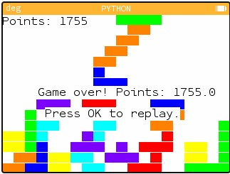
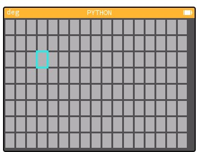
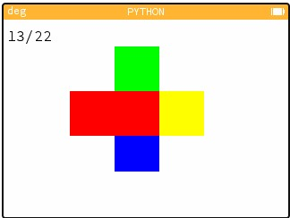
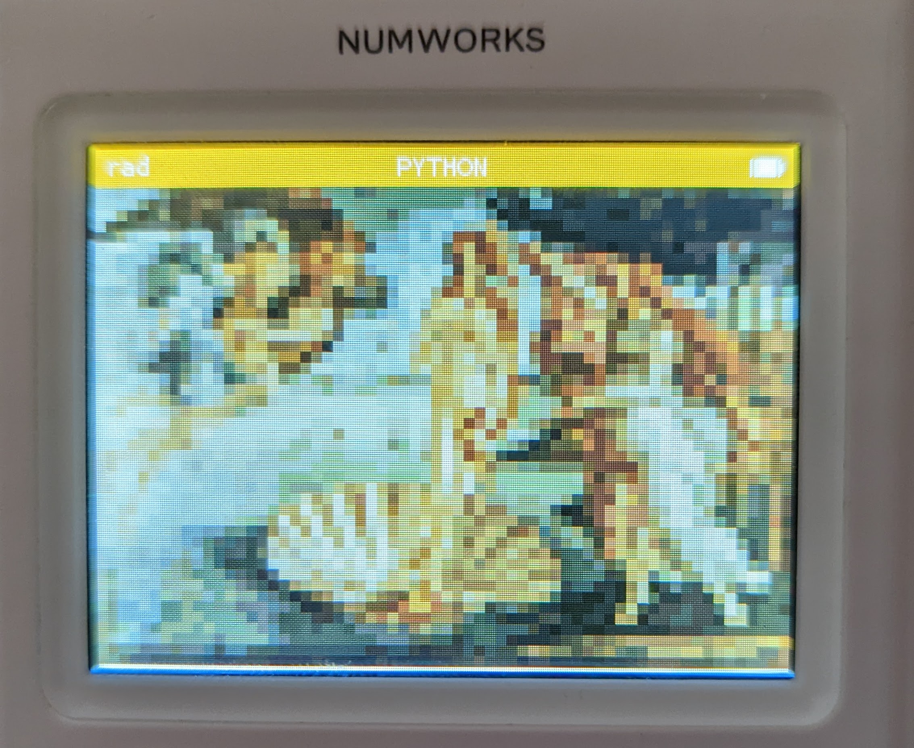

# Numworks Games

 A collection of small games of the Numworks Calculator that can run in its python interface.

 *Warning: **A LOT** of spaghetti code here and copy-pasted lines, these programs are made to work and not much more than that. I have added comments to try and make them more legible but they come with no support.*

 Each script has the version I write, and then a minified version to store on the calculator. Minification engine: https://python-minifier.com/

## Tetris

Basic Tetris for a Numworks calculator.  Uses **left** and **right** arrows to move, **down** to move down faster and **up** to rotate. Has **7 bag** to ensure more fun gameplay. The **entire program is procedural** so you can change the width and height in the code to your liking (the settings I have chosen are just what I recommend). Start the game with `tetris()` *Note: points are not scored the same way as in modern Tetris.*

*Install at:* https://my.numworks.com/python/superzooper3/tetris

## Minesweeper

A minesweeper game for a numworks calculator. **Arrows** to move, **OK** to fire, **(** to flag and **)** to unflag. Start the game with `minesweeper()`.**Fully procedural** so you can make the board **any shape** you would like with the inputs at the start as well as add as many **bombs as you would like!** Using **flags protects you** from accidentally triggering a bomb square. All **boards guarantee** that the first cell is safe for more winnable games.

*Install at:* https://my.numworks.com/python/superzooper3/minesweeper

## Dance

A very simple game where you use the **arrow keys** to select which direction to press in depending on how the colours line up. To start it, use `dance()` and once you see 4 colours, click up to get your first center colour.

*Install at:* https://my.numworks.com/python/superzooper3/dance

## Images

A great way to store and display images on the numworks calculator.

Encode images on the computer by placing them in the `scripts/images/images` directory (png or jpg). Then run `IMGencode.py` to transform all these images into cusotm compacted data that the calculator can use, it's output into `scripts/images/imgdta.py`. Use the numworks interface to push that code to the calculator and install the drawing engine at https://my.numworks.com/python/superzooper3/draw_img.

To draw images on the calculator, run `draw_img.py` (run it alone, the calculator dosen't have enough ram to run it with other programs as well) and then use the function `DRAW_IMG()` to start the engine. It'll ask you for an image ID, a number determined by the order images were encoded in (just do trial and error) and once you hit enter, it'll draw the picture on your screen!

 

(encoded with a scaling factor of 5 and a colour depth of 7 with 5 images in the imgdta package)

*Notes*:

- The calculator has very limited ram to load images (arround 16kb per my testing), so you can adjust the images' scaling factor as well as the colour depth to make them smaller.
- There is a known issue on transparent images encoding that has to do with the way PIL reads pixel colours. *For futre me: to fix it, test of full transparency and then set to white if true*
