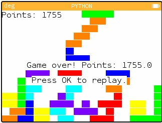
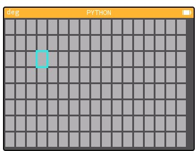
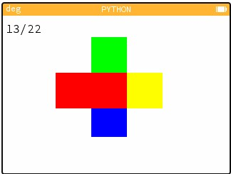

# Numworks Games
 A collection of small games of the Numworks Calculator that can run in its python interface. 
 
 *Warning: **A LOT** of spaghetti code here and copy-pasted lines, these programs are made to work and not much more than that. I have added comments to try and make them more legible but they come with no support.*

## Tetris:
Basic Tetris for a Numworks calculator.  Uses **left** and **right** arrows to move, **down** to move down faster and **up** to rotate. Has **7 bag** to ensure more fun gameplay. The **entire program is procedural** so you can change the width and height in the code to your liking (the settings I have chosen are just what I recommend). Start the game with `tetris()` *Note: points are not scored the same way as in modern Tetris.* 

*Install at:* https://my.numworks.com/python/superzooper3/tetris

## Minesweeper:
A minesweeper game for a numworks calculator. **Arrows** to move, **OK** to fire, **(** to flag and **)** to unflag. Start the game with `minesweeper()`.**Fully procedural** so you can make the board **any shape** you would like with the inputs at the start as well as add as many **bombs as you would like!** Using **flags protects you** from accidentally triggering a bomb square. All **boards guarantee** that the first cell is safe for more winnable games.

*Install at:* https://my.numworks.com/python/superzooper3/minesweeper

## Dance
A very simple game where you use the **arrow keys** to select which direction to press in depending on how the colours line up. To start it, use `dance()` and once you see 4 colours, click up to get your first center colour. 

*Install at:* https://my.numworks.com/python/superzooper3/dance 

